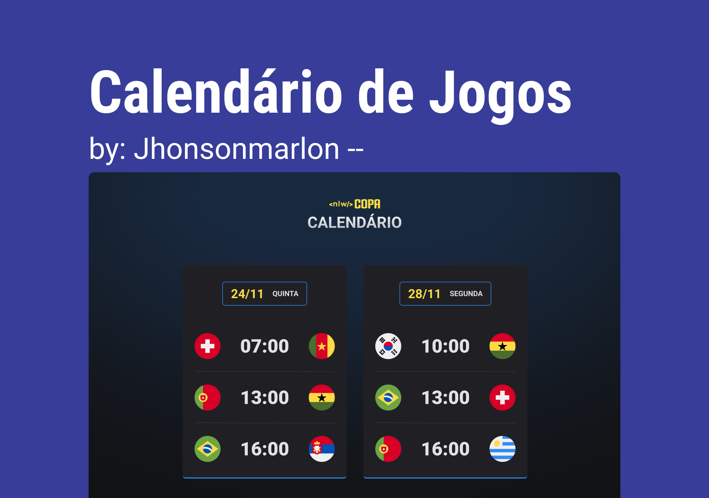
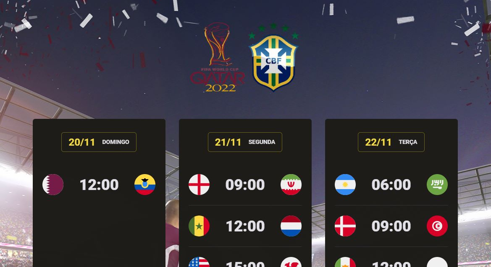

# 🚀 CALENDÁRIO DA COPA DO MUNDO - CATAR 2022

Bem-vindo(a). Este é o calendário da copa do mundo 2022!

O objetivo deste projeto é demonstrar minhas habilidades de programação.
Quando minha solução estiver pronta, podes me gratificar, ou me ajudar no que achar necessário!
Em seguida, enviarei o meu feedback agradecendo, seja pela ajuda ou crítica!

Caso tenha alguma dúvida, estou disponível no email *j.marlon.developer@gmail.com*
Boa vistoria de projeto!

> ⚠️ **É importante que entenda minha inicialidade em alguns pontos, pois estou aprendendo**

# 🧠 O PROJETO

O projeto foi implementar um calendário para demonstração das datas dos jogos da copa do mundo de 2022:

- [ ] Logo dos países participantes
- [ ] Horário e dia de cada jogo
- [ ] layout decorativo da copa

## ✔️ TECNOLOGIAS/MÉTODOS UTILIZADO(A)S:

Além dos requisitos levantados acima, foram utilizadas algumas tecnologias e métodos para construção do projeto:

- HTML
- CSS
- Responsividade
- JAVASCRIPT

## 😎 FOI UM PRAZER!

- Estamos finalizando mais um projeto, e com ele veio mais experiência foi agregada, obrigado pela atenção e contribua com sugestôes do que melhorar e outros projetos que queira ver aqui neste profile: https://github.com/Jhonsonmarlon
- link do disign: https://www.figma.com/file/Uk2JpDnizrBW9bQr4XDVGG/Calend%C3%A1rio-de-Jogos-(Community)?node-id=0%3A1&t=2Gp71ui8hlDYenAG-0
- Plataforma de curso: ROCKETSEAT 🚀

---

_O desafio acima foi cuidadosamente construído para propósitos de aprendizado, e experiência._

Made with 🧑‍💻 at Jhonson_Marlon
